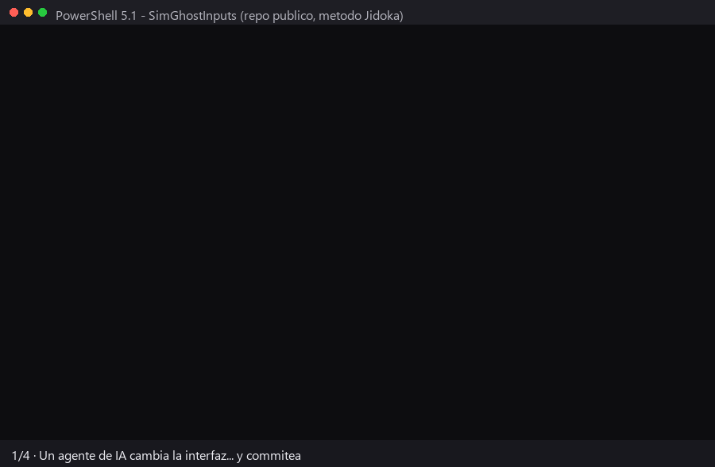

<h1 align="center">Jidoka</h1>

<p align="center"><strong>Dirige agentes de IA sin depender de su palabra.</strong><br>
La disciplina vive en gates <em>fuera</em> del modelo —hooks, CI, branch protection— y el juicio se queda en ti.<br>
Es el Sistema de Producción Toyota, aplicado al trabajo con agentes.</p>

<p align="center"><a href="#velo-bloquear-un-cambio-malo-hoy-en-3-pasos"><strong>Instálalo y velo bloquear — hoy, en 3 pasos ↓</strong></a><br>
<em>instalador PowerShell que funciona hoy · <code>npx jidoka-method init</code> en camino (<a href="ROADMAP.md">roadmap</a>)</em></p>

<p align="center">
<a href="LICENSE"></a>


<a href="ROADMAP.md"></a>
</p>

<p align="center">🟢 <strong><code>v1.0.0</code></strong> — <strong>este repo se gobierna con su propio Andon</strong>: los <a href="https://github.com/ArmandoMedina/jidoka/pulls?q=is%3Apr">PRs</a>, los <a href="https://github.com/ArmandoMedina/jidoka/actions">checks</a> y los <a href="docs/sprints/">sprints archivados</a> son la evidencia, no la palabra.</p>

<p align="center"><strong>En español, a propósito.</strong></p>

> **English?** Jidoka is the Toyota Production System, adapted for AI coding agents — doctrine + method + sprint ritual, enforced by **deterministic gates** (the "Andon" wall) that catch mistakes at the source, *outside* the LLM, instead of trusting the agent to behave. It's written and defended in Spanish on purpose: the prose is part of its identity. An English translation isn't planned — but the machinery speaks for itself, and it's language-agnostic: read the [PRs](https://github.com/ArmandoMedina/jidoka/pulls), the [checks](https://github.com/ArmandoMedina/jidoka/actions), and the [releases](https://github.com/ArmandoMedina/jidoka/releases).

---

## ¿Te suena?

- **«Listo, todos los tests pasan»** — y no compilaba.
- **Ayer lo sabía todo; hoy no recuerda nada** — cada sesión arranca de cero y re-decide lo ya decidido.
- **Le escribiste memorias y ni las lee** — cada chat, a explicarle todo de cero, a ver si hay suerte.
- **Arregló una cosa y rompió tres** — y te enteraste tú, no él.
- **La documentación dice una cosa y el código otra** — y te enteras cuando ya nadie sabe cuál es la verdad.

Programar con agentes de IA falla por ahí: pierden el contexto entre sesiones y **cooperan con su propia mentira** — te dicen "listo" cuando no, porque son un actor que no recuerda y no tiene nada que perder. Jidoka parte de una ley incómoda:

> Un mecanismo de gobierno es **muro real solo si el punto de control vive FUERA del LLM.**
> Si depende de que el modelo coopere, no es muro — es una sugerencia.

## Qué hace por ti

- **Cuando el agente dice «listo» y no es cierto, algo lo para.** El check de Andon corre en el CI (el robot de GitHub que revisa cada cambio) y la branch protection es el candado: nada entra sin pasar el robot. Leen el artefacto (el diff, el archivo, el log), no la palabra del agente. La escalera completa: *el hook local avisa → el pre-push frena → el CI + branch protection bloquean*. El motor vive en [`tools/`](tools/); su doctrina y sus fronteras, dichas de frente, en [`andon/`](andon/).
- **La memoria vive en artefactos, no en el modelo.** El plan que apruebas *es* el sprint y se archiva; el `HANDOFF.md` es el relevo que la siguiente sesión lee al abrir; y cada decisión queda escrita con su porqué en un ADR (un archivito por decisión — para que el agente lo lea mañana en vez de re-decidirlo). Mañana el agente **lee** — no "recuerda". El ritual, en [`kanban/`](kanban/).
- **Quién hace qué no depende de que el agente lo adivine.** Al abrir, `/jidoka:arranca` **sienta la sesión en su asiento** (el casting del repo) y **lee el router** de la ley (`tools/rutear.ps1`): qué cambio se rutea a qué gate, y qué gates están **vivos o dormidos** —con la razón de cada dormido, para que la dormancia no sea un silencio. La conciencia del método se instala como maquinaria, no como prosa que el agente debería recordar.
- **Y si no sabes ni qué construir, el método te saca la sopa.** `/jidoka:descubre` es la capa de consultoría: una entrevista con preguntas fijas —hechos pasados, nunca hipotéticos ("cuéntame la última vez que…", jamás "¿te gustaría…?")— que convierte una idea borrosa en un brief con caso concreto, métrica con número, apetito y no-metas. Y si el que sabe del dominio es otra persona que no usa la IA (tu contador, tu experto), te arma el **kit de entrevista portátil** para llevárselo por WhatsApp y traer sus respuestas como evidencia. Lo que apruebas, lo apruebas **con nombre** — un "dale" no cierra un QUÉ.
- **Lo que ya funcionaba se defiende solo.** Se construye en rebanadas pequeñas que dejan el proyecto funcionando en cada paso, el CI es obligatorio, y los gates traen **prueba de vida**: un self-test con un caso que DEBE bloquear, para que el muro no se pudra en silencio.
- **Tú diriges sin leer código ni terminal.** Apruebas el QUÉ antes de que se construya y revisas el **demo corriendo** (Gemba) —abres, haces clic, miras— con tus propios ojos; si la única forma de verlo es corriendo un script, la rebanada no está terminada. Y la evidencia que el gate exige es el **`LOG.md` de la corrida**, no cualquier archivo suelto que diga "pasó". *"Hecho" = lo viste funcionar.* El juicio se queda contigo; el procedimiento, en la máquina.

## Velo bloquear un cambio malo (hoy, en 3 pasos)



*Corrida real en [SimGhostInputs](https://github.com/ArmandoMedina/SimGhostInputs) (repo público): un agente cambia la interfaz y commitea; el gate lee el diff, encuentra la guía de usuario sin actualizar y detiene el push — hasta que código y docs vuelven a decir la verdad juntos. La terminal es un render fiel, no una grabación: cada línea es salida capturada de la corrida (evidencia cruda en [`qa_runs/gif-gate-20260711/`](qa_runs/gif-gate-20260711/)).*

**Lo que necesitas hoy:** Windows + PowerShell 5.1 y git. El ritual (`/jidoka:*`, skills) corre sobre [Claude Code](https://claude.com/claude-code). Multiplataforma y el CLI `npx` vienen en el [roadmap](ROADMAP.md).

**¿Mac/Linux?** Buena parte ya te sirve: la ley (`blast-radius.json`) es JSON puro y portable, el ritual corre donde corra Claude Code, y el muro real —el check de Andon— corre **server-side** en un runner Windows de GitHub Actions aunque tu máquina no lo sea. Lo Windows-only de hoy son los hooks locales y el instalador.

**Y el gasto tiene techo:** Jidoka corre íntegramente dentro de Claude Code — todo, incluido el modo desatendido y sus subagentes, se cubre con [tu suscripción](https://support.claude.com/en/articles/11145838-use-claude-code-with-your-pro-or-max-plan) (Pro/Max), sin API key ni cobro por token. Tu gasto máximo es la mensualidad, dentro de los límites de uso del plan — puedes experimentar sin miedo a la factura.

**En ~3 minutos ves el `[BLOQUEA]` rojo con tus propios ojos:**

```powershell
# 1. Clona Jidoka y siembra el método en tu repo (elige arquetipo con -Arquetipo: docs-as-code · code-first)
git clone https://github.com/ArmandoMedina/jidoka
./jidoka/tools/instalar.ps1 -Destino C:\ruta\a\tu-repo   # no-clobber: nunca sobrescribe nada tuyo

# 2. Enciende el muro real (una vez, en GitHub): branch protection de main con el check de Andon
#    requerido y sin bypass — los 3 clics exactos, en andon/README.md
#    (los hooks locales ya los encendió el instalador)

# 3. Provoca un bloqueo para verlo morder — tal cual, dentro del clon de jidoka:
Set-Content docs\decisions\9999-demo.md '# ADR 9999 - demo'   # una decisión SIN listar en su índice
git add .; git commit -m "demo: ADR sin listar"
./tools/verificar.ps1        # → [BLOQUEA] ... PUSH DETENIDO. (exit 1)
git reset --hard HEAD~1      # limpieza: borra el commit del demo
```

En tu repo sembrado el mismo verificador corre solo en cada `git push` (mide los commits que estás por subir; el instalador deja el motor en `tools/` y el índice de ADRs listo). Y el paso 3 no es un truco de demo: el caso "ADR sin listar DEBE bloquear" vive en el **self-test** (`tools/probar-gate.ps1`) que corre en cada PR de este repo — un gate que nunca rechaza nada está podrido aunque el tablero esté verde; aquí, quien valida también se valida.

## Corriendo en un repo real

El método no se prueba en un pizarrón: [**SimGhostInputs**](https://github.com/ArmandoMedina/SimGhostInputs) — una herramienta de telemetría para simracing — es un repo público construido dirigiendo agentes con este método. Puedes auditarlo tú mismo: [32 versiones publicadas](https://github.com/ArmandoMedina/SimGhostInputs/releases) con instalador generado por CI, [sus decisiones documentadas](https://github.com/ArmandoMedina/SimGhostInputs/tree/master/docs/decisions), la evidencia de demos en [`qa_runs/`](https://github.com/ArmandoMedina/SimGhostInputs/tree/master/qa_runs) y la misma maquinaria de gates (`.githooks/`, `tools/`) corriendo en sus PRs — el GIF de arriba es una corrida real ahí. Nada de esto hay que creerlo: se hace clic. La historia completa del linaje, en [`docs/casos-de-exito.md`](docs/casos-de-exito.md).

## El sistema (por qué se llama Jidoka)

Cada pieza es un pilar real del Sistema de Producción Toyota:

| Pieza | Concepto Toyota | Qué es aquí |
|---|---|---|
| **Jidoka** | Autonomación: la máquina se detiene sola ante el defecto; el humano aporta juicio | El método completo |
| **Andon** | El cordón que cualquiera jala para parar la línea | Los **gates deterministas** (hooks + CI + branch protection) |
| **Kanban** | El flujo tirado por tarjetas | El **ritual de sprint** (plan → demo → retro) |
| **Kaizen** | Mejora continua | La **retro** de cada sprint — lo aprendido, versionado |
| **Gemba** | *"El lugar real"*: ve a verlo con tus ojos | El **demo visual** que el cliente corre solo |
| **Poka-yoke** | A prueba de errores | Los gates `deny` y las reglas que hacen el error imposible |

Y no es la única herencia: la ingeniería de calidad del siglo XX ya pagó este problema en otros dominios. De la aviación, Jidoka toma su eje central de diseño — **Airbus pone límites duros que no puedes cruzar** (= gates `deny`, para lo irreversible) **y Boeing avisa pero te deja anular** (= gates `ask`, para lo que pide juicio) — y una ironía que la aviación documentó hace décadas: *mientras mejor es la máquina, más hay que invertir en mantener vivo el juicio del humano*. Por eso apruebas el QUÉ y ves el demo: el juicio se ejercita, no se atrofia. El linaje completo, verificado contra fuente primaria, en [`doctrina/`](doctrina/) (aviación: [`doctrina/03-aviacion.md`](doctrina/03-aviacion.md)).

## Cómo se trabaja: el ritual Kanban

Un sprint de Jidoka es un lazo corto de cuatro tiempos. La tarjeta pasa por **Borrador → Aprobado → En curso → Revisión → Hecho**:

1. **Planea** (`/jidoka:planea`) — la IA explora y escribe el plan en *plan mode*; **tú lo apruebas**. El plan aprobado *es* el sprint, y se archiva.
2. **Construye** — el agente avanza en rebanadas verticales, cada paso verde. El **Andon local avisa**; el **CI bloquea**.
3. **Revisa en dos capas** — los **robots** revisan el código (`/code-review` + gates de CI); **tú** revisas el **Gemba**: el incremento corriendo, verificado contra lo que pediste.
   > **Regla de oro:** el cliente revisa el *demo*, nunca el PR.
4. **Cierra** (`/jidoka:cierra`) — **Kaizen**: la retro al récord del sprint; el estado al HANDOFF. La lección viaja al siguiente sprint; el contexto no.

Tres reglas de diseño que lo atraviesan todo: **el plan ligero es el contrato** (sin ceremonia de más); **cada asiento tiene una sola responsabilidad** ([`kanban/roles.md`](kanban/roles.md)); y **la disciplina escala con el riesgo** — al instalar eliges el arquetipo de tu repo y se enciende solo la maquinaria que ese proyecto merece. Es un menú, no un molde.

## Dónde va Jidoka

Qué hay **hoy** y qué viene (detalle en [`ROADMAP.md`](ROADMAP.md)):

| Sprint | Qué | Estado |
|---|---|---|
| **0 — Identidad** | Doctrina embebida, el sistema TPS, este README | ✅ `v0.1.0-beta` |
| **1 — Motor Andon** | La ley (`blast-radius.json`) + verificador + self-test + hooks + CI, corriendo **sobre este mismo repo** | ✅ `v0.2.0-beta` |
| **2 — Ritual Kanban** | Comandos `/jidoka:*`, skills-asiento, `gemba-stop` + `review-stop`, auditor del grafo | ✅ `v0.5.0` · `v0.6.0-beta` |
| **3 — Instalador** | `tools/instalar.ps1` con arquetipos ejecutables (`docs-as-code` · `code-first`) + 12 templates | 🔨 Fases A y B publicadas (`v0.7.0` · `v0.8.0-beta`); falta CLI `npx` + multiplataforma |
| **Homologación** | Una sola metodología: Jidoka como superset de sus labs; las cosechas de SGI de vuelta al método | ✅ `v0.9.0` · `v0.10.0-beta` |
| **4 — Estable** | El método corre end-to-end en un repo ajeno; guías completas | ✅ `v1.0.0` — cumplido en 2 labs (SGI · TF); presentación pública post-1.0 |

## Empezar

- **¿Vienes a probarlo?** [Velo bloquear un cambio malo](#velo-bloquear-un-cambio-malo-hoy-en-3-pasos) — 3 pasos, ~3 minutos.
- **¿Escéptico?** Audita [SimGhostInputs](https://github.com/ArmandoMedina/SimGhostInputs) o los [PRs de este repo](https://github.com/ArmandoMedina/jidoka/pulls?q=is%3Apr) — el método corriendo, no descrito.
- **¿Quieres entender lo que sembraste?** [`andon/`](andon/) (los gates y sus fronteras, dichas de frente) y [`kanban/`](kanban/) (el ritual completo).
- **¿Empiezas de cero, sin repo y sin git?** La [guía](docs/guias/empezar-de-cero.md) está en construcción (Sprint 4); mientras, abre un [issue](https://github.com/ArmandoMedina/jidoka/issues) y te orientamos.
- **¿Algo que enseñarle al método?** [`CONTRIBUTING.md`](CONTRIBUTING.md) — las lecciones de campo son bienvenidas.

## Licencia

[MIT](LICENSE). © 2026 Armando Medina y colaboradores de Jidoka. Úsalo, estúdialo, modifícalo y compártelo — incluso comercialmente — sin ataduras. Si te sirve, un ⭐ y avisa qué construiste — y si te ahorró horas, [un café](https://ko-fi.com/armandomedina2255) mantiene la línea andando. ☕

---

<p align="center"><em>No puedes hacer infalible al modelo. Puedes cambiar las condiciones —los gates— bajo las que opera.</em></p>
